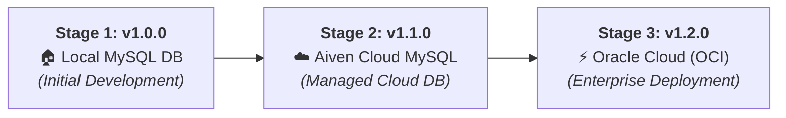
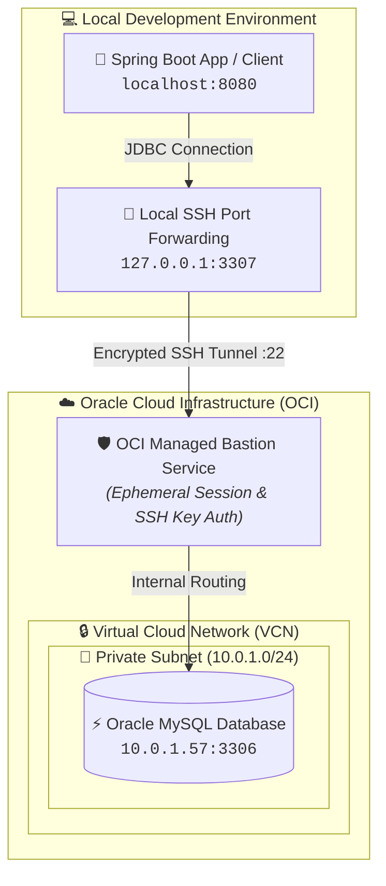

# SpringCrudDTO

A Spring Boot application demonstrating CRUD (Create, Read, Update, Delete) operations using Data Transfer Objects (DTOs) and Spring Data JPA with a MySQL database.

---

## 📈 Stages of Progression

An overview of the evolutionary roadmap and infrastructure progression of the project:



### 📍 Progression Details

* **Stage 1: Local Database (`v1.0.0`)** 🏠
  * Configured and tested with a locally hosted MySQL instance.
  * Established the base architecture: entity mapping, DTO-based separation, soft-delete functionality, and Bruno API test suites.

* **Stage 2: Aiven Cloud Migration (`v1.1.0`)** ☁️
  * Transitioned to a managed MySQL service on **Aiven Cloud**.
  * Enabled remote database access, secured connection handling with SSL/TLS, and introduced environment variable credential management (`${DB_PASSWORD}`).

* **Stage 3: Oracle Cloud Infrastructure (`v1.2.0` — *Current*)** ⚡
  * Migrated the database layer to **Oracle Cloud Infrastructure (OCI)**.
  * Achieved higher reliability, enterprise-grade cloud capabilities, scalable performance, and production readiness.

---

## 🏷️ Version Basis & History

| Version | Milestone | Key Features & Infrastructure |
| :--- | :--- | :--- |
| **`v1.0.0`** | **Local Foundation** | Initial CRUD REST APIs, DTO layer, Hibernate soft-deletion, Local MySQL setup. |
| **`v1.1.0`** | **Aiven Cloud Integration** | Shifted to managed cloud database via Aiven, remote credentials configuration. |
| **`v1.2.0`** | **Oracle Cloud Migration** | Upgraded database infrastructure to Oracle Cloud (OCI) for enterprise deployment. |

---

## Technologies Used
- **Java 21**
- **Spring Boot 3.4.1**
- **Spring Web** (RESTful APIs)
- **Spring Data JPA** (Hibernate)
- **MySQL Connector/J** (Database connection)
- **Maven** (Dependency management and build tool)

## Functionalities

The application exposes a set of RESTful APIs to manage `Student` records via the `StudentController`. It extensively implements the DTO pattern (using `CreateStudentRequestDTO` and `CreateStudentResponseDTO`) to completely decouple the internal database entities from the API layer for creation, retrieval, and updating processes. Record timestamps (`createdAt` and `updatedAt`) are automatically managed by the application service during state changes.

Additionally, the project supports both **hard deletion** and **soft deletion** of records.

### API Testing (Bruno)
The project includes a ready-to-use API testing collection for [Bruno](https://www.usebruno.com/). The endpoint configuration files are conveniently located inside the `src/Bruno Endpoints` directory. You can import this folder directly into your Bruno client to quickly test all the CRUD APIs without needing to configure the requests manually.

### API Endpoints

| HTTP Method | Endpoint                        | Description |
|---|---------------------------------|---|
| `POST` | `/api/student`                  | Creates a new student record using `CreateStudentRequestDTO`. Returns a `CreateStudentResponseDTO` upon success. |
| `GET` | `/api/student/{id}`             | Retrieves a specific active (non-deleted) student by their ID, mapping it to a `CreateStudentResponseDTO`. |
| `GET` | `/api/student`                  | Retrieves a list of all active students in the database, mapping them to `CreateStudentResponseDTO`s. |
| `PUT` | `/api/student/{id}`             | Updates the information of an existing active student using `CreateStudentRequestDTO`, returning a `CreateStudentResponseDTO`. |
| `DELETE` | `/api/student/{id}`             | Permanently deletes a student record from the database (Hard Delete). |
| `DELETE` | `/api/student`         | Permanently deletes all student records from the database. |
| `PATCH` | `/api/student/{id}` | Marks a student record as deleted by setting a `deleted` flag to true (Soft Delete), hiding it from standard fetch queries. |

## 🌐 Network & Cloud Infrastructure Architecture

The project employs enterprise-level network security and cloud infrastructure practices to connect the Spring Boot application to remote cloud databases securely:



### 🔒 Key Networking Principles Applied
* **Zero-Trust Private Subnet Isolation**: The database instance resides entirely in an isolated private subnet (`10.0.1.0/24`) without an allocated public IP address, preventing exposure to the public internet and defending against automated scanning or brute-force attacks.
* **Ephemeral Bastion SSH Tunneling (L4 TCP Forwarding)**: Secure administrative and application connectivity is achieved through Oracle Cloud Infrastructure (OCI) Bastion sessions. By utilizing asymmetric RSA key pairs and time-to-live (TTL) constrained sessions, local traffic on `127.0.0.1:3307` is encrypted and forwarded directly to the private target host (`10.0.1.57:3306`).
* **Secret Management & Environment Decoupling**: Database credentials and sensitive connection variables are externalized using environment variables (`${DB_PASSWORD}`), eliminating hardcoded secrets in source control.

---

## 🗄️ Database Management & Data Architecture

### 📊 Relational Schema Specification
* **Target Engine**: MySQL 8.0+ / OCI MySQL Database Service
* **Primary Entity**: `students` table

| Column | Type | Constraints | Description |
| :--- | :--- | :--- | :--- |
| `id` | `BIGINT` | `PRIMARY KEY`, `AUTO_INCREMENT` | Unique identifier generated by DB identity strategy. |
| `name` | `VARCHAR(255)` | `NOT NULL` | Full name of the student. |
| `age` | `INT` | `NOT NULL` | Age of the student. |
| `roll_no` | `INT` | `NOT NULL` | Unique/assigned roll number. |
| `email` | `VARCHAR(255)` | `NOT NULL` | Contact email address. |
| `subject` | `VARCHAR(255)` | `NOT NULL` | Enrolled academic major/subject. |
| `created_at` | `TIMESTAMP` | `NOT NULL` | Immutable audit timestamp for record creation. |
| `updated_at` | `TIMESTAMP` | `NOT NULL` | Audit timestamp tracking last record update. |
| `deleted` | `BOOLEAN` | `DEFAULT FALSE` | Soft-delete state flag for non-destructive retention. |

### ⚙️ Database Engineering Highlights
* **Soft Delete Strategy & Data Retention**: Employs non-destructive deletion via a boolean `deleted` state flag. Application queries (`findByDeletedIsFalse`, `findByIdAndDeletedIsFalse`) filter out soft-deleted records to preserve referential integrity, historical traceability, and data recovery capabilities, while dedicated hard-delete endpoints allow permanent removal when required.
* **Auditability & Lifecycle Tracking**: Automatically captures temporal audit metadata (`createdAt` and `updatedAt`) during entity persistence and update operations, ensuring reliable data version tracking.
* **Connection Pooling & Datasource Optimization**: Configured to work seamlessly with HikariCP high-performance connection pooling, ensuring minimal latency, proactive connection validation, and secure SSL/TLS negotiation parameters (`allowPublicKeyRetrieval=true`).
* **Object-Relational Mapping (ORM) Decoupling**: Utilizes Spring Data JPA and Hibernate to abstract database-agnostic operations, while preserving optimal index utilization and query generation.

---

## How to Run

1. Ensure you have Java 21 and Maven installed.
2. Ensure you have a running instance of MySQL.
3. Update the `application.properties` (or `.yml`) file inside `src/main/resources` with your MySQL database credentials (url, username, password).
4. Run the application using your IDE or via the command line:
   ```bash
   ./mvnw spring-boot:run
   ```
